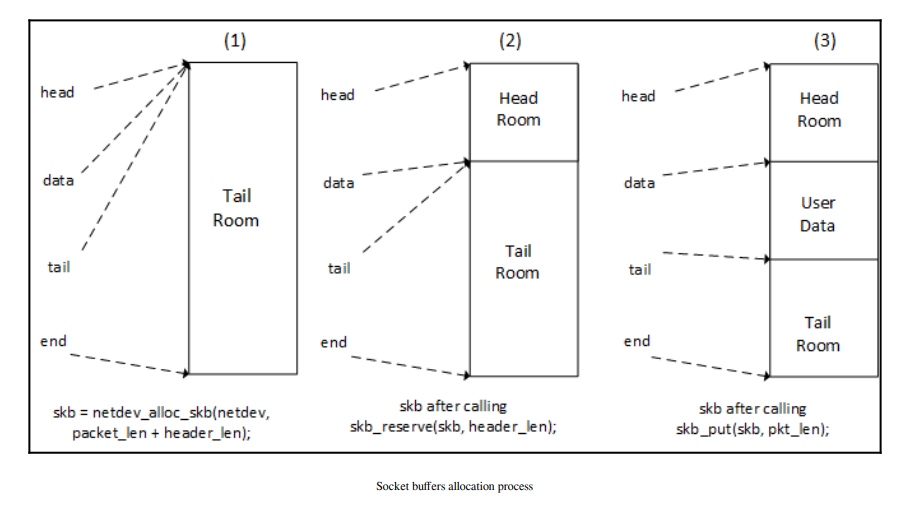

# Network Interface Card (NIC)

Network Interface Card (NIC), còn được gọi là card mạng hay adapter mạng, là một phần cứng máy tính được thiết kế để kết nối máy tính với một mạng máy tính. NIC thực hiện việc chuyển đổi dữ liệu từ định dạng được sử dụng trong máy tính (dạng số) sang định dạng có thể được truyền qua cáp mạng (thông thường là dạng tín hiệu điện hoặc quang).

Các tính năng và thành phần chính:

-  kết nối: NIC thường có một hoặc nhiều cổng kết nối vật lý, thường là cổng Ethernet RJ-45, nhưng cũng có thể là các loại khác như Wi-Fi, fiber optic, etc.

- MAC Address: Địa chỉ phần cứng duy nhất được gán cho mỗi NIC. Địa chỉ MAC (Media Access Control) được sử dụng trong quá trình định tuyến trong mạng LAN.

- Driver phần mềm: Để NIC có thể hoạt động được với hệ điều hành, nó cần có một driver, là phần mềm điều khiển cung cấp giao tiếp giữa hệ điều hành và phần cứng NIC.

- Buffer và Queue: NICs thường có bộ đệm và hàng đợi để lưu trữ dữ liệu đến và đi, giúp giảm thiểu sự mất dữ liệu và tăng hiệu suất.

- Offload Engines: Một số NIC hiện đại có các tính năng như TCP Offloading, giúp giảm bớt tải cho CPU bằng cách xử lý một số công việc liên quan đến mạng ngay trên card.

Vai trò trong mạng máy tính:

- Kết nối Fizik: NIC cung cấp cổng kết nối vật lý giữa máy tính và mạng, thực hiện việc mã hóa và giải mã tín hiệu.

- Định tuyến và Định địa chỉ: Địa chỉ MAC duy nhất giúp trong việc định tuyến gói tin trong mạng cục bộ.

- Tương tác với Hệ điều hành: Thông qua driver, NIC tương tác với hệ điều hành để nhận và gửi dữ liệu qua mạng.

- Hiệu suất và Tối ưu hóa: Các tính năng như bộ đệm, hàng đợi, và offload engines giúp tăng hiệu suất và ổn định của việc truyền dữ liệu.

Tóm lại, NIC là một thành phần quan trọng trong hệ thống mạng máy tính, cung cấp giao diện giữa máy tính và mạng mà nó kết nối.


Khi xử lý các thiết bị NIC, có hai cấu trúc dữ liệu  cần sử dụng:

## Cấu trúc sk_buff

Cấu trúc sk_buff (socket buffer) là một cấu trúc dữ liệu quan trọng trong lập trình mạng của hệ điều hành Linux. Nó được sử dụng để quản lý các gói dữ liệu trong kernel của Linux. sk_buff hỗ trợ việc truyền tải dữ liệu giữa các tầng trong mô hình OSI (Open Systems Interconnection), từ tầng ứng dụng xuống đến tầng vật lý, và ngược lại.


### Vai trò trong Networking

Buffer Management: sk_buff giúp quản lý bộ đệm dữ liệu được truyền đi và nhận về.

Layer Interaction: Nó cung cấp một cách tiện lợi để truyền dữ liệu và thông tin kiểm soát giữa các tầng trong mô hình OSI.

Performance: Việc sử dụng sk_buff giúp cải thiện hiệu suất bằng cách giảm bớt việc sao chép dữ liệu giữa các tầng.

Modularity: Các module mạng có thể dễ dàng thao tác với sk_buff mà không cần phải quan tâm đến cách dữ liệu được lưu trữ hoặc quản lý.

Nói chung, sk_buff là một phần quan trọng của hệ thống mạng trong kernel Linux, giúp quản lý và tối ưu hóa việc truyền dữ liệu.

### Giải thích các trường chính

struct sk_buff * next; struct sk_buff * prev;: Các con trỏ này được sử dụng để liên kết nhiều cấu trúc sk_buff với nhau, thường là trong một danh sách liên kết đôi. Điều này hữu ích cho việc xếp hàng các gói tin.

ktime_t tstamp;: Đây là một dấu thời gian thường chỉ ra khi nào gói tin được nhận.

struct rb_node rbnode;: Trường này được sử dụng trong cây Red-Black cho việc lập lịch gói tin trong các tình huống như mô phỏng mạng (netem) và ngăn xếp TCP.

struct sock * sk;: Con trỏ này chỉ đến cấu trúc socket sở hữu bộ đệm này. Nó được sử dụng để tìm thông tin về kết nối mạng.

struct net_device * dev;: Con trỏ này chỉ đến thiết bị mạng (thông thường là một NIC) mà qua đó gói tin này sẽ được gửi hoặc từ đó đã được nhận.

unsigned int len;: Trường này chỉ ra tổng chiều dài của dữ liệu trong bộ đệm. Nó bao gồm cả header và dữ liệu.

unsigned int data_len;: Đây là chiều dài của phần dữ liệu chỉ, không bao gồm các header.

__u16 mac_len;: Đây là chiều dài của header MAC (Media Access Control).

__u16 hdr_len;: Đây là chiều dài của các header tầng mạng và tầng vận chuyển kết hợp lại.

__u32 priority;: Đây là trường ưu tiên của gói tin. Trường này thường được sử dụng trong các thuật toán lập lịch và xếp hàng để xác định thứ tự các gói tin được xử lý hoặc truyền đi.

dma_cookie_t dma_cookie;: Đây là một định danh DMA (Direct Memory Access) được sử dụng để theo dõi các hoạt động DMA liên quan đến gói tin này. DMA được sử dụng để truyền dữ liệu giữa RAM và NIC mà không cần sự can thiệp của CPU.

sk_buff_data_t tail; sk_buff_data_t end;: Các trường này định rõ vị trí cuối cùng của dữ liệu và bộ đệm trong sk_buff. tail thường chỉ đến cuối dữ liệu, trong khi end chỉ đến cuối bộ đệm.

unsigned char * head; unsigned char * data;: head là con trỏ đến đầu của bộ đệm, trong khi data là con trỏ đến dữ liệu thực sự trong bộ đệm. Dữ liệu thực sự có thể không bắt đầu ngay tại đầu của bộ đệm.

unsigned int truesize;: Đây là kích thước thực sự của bộ đệm trong bộ nhớ, bao gồm cả dữ liệu và các thông tin phụ trợ khác.

atomic_t users;: Đây là một biến nguyên tử dùng để theo dõi số lượng các quá trình hoặc ngữ cảnh mạng đang sử dụng sk_buff này. Nó giúp trong việc quản lý bộ nhớ, chẳng hạn như khi cần giải phóng sk_buff.

>Vai trò trong Mạng máy tính:
- Liên kết Gói: Các con trỏ next và prev cho phép kernel quản lý hàng đợi các gói tin một cách hiệu quả.

- Thông tin về Thời gian: Trường tstamp có thể được sử dụng cho nhiều tác vụ liên quan đến thời gian như tính toán thời gian chuyển đổi trong TCP.

- Lập lịch và Ưu tiên: Trường rbnode cho phép gói tin được chèn vào một thuật toán lập lịch dựa trên cây Red-Black.

- Tương tác giữa các Tầng: Các trường như sk và dev giúp trong việc tương tác giữa tầng mạng và tầng vận chuyển, cũng như với phần cứng NIC thực sự.

- Xử lý Dữ liệu: Các trường len, data_len, mac_len, và hdr_len cung cấp thông tin chi tiết về kích thước của các phần khác nhau của gói tin, điều này rất quan trọng cho việc xử lý chính xác và hiệu quả.

- Quản lý Ưu tiên: Trường priority giúp trong việc xác định thứ tự xử lý và truyền tải gói tin.

- Tối ưu hóa Truyền dữ liệu: dma_cookie giúp trong việc tối ưu hóa việc truyền dữ liệu qua DMA.

- Quản lý Bộ đệm: Các trường như tail, end, head, và data cung cấp thông tin chi tiết về cách dữ liệu được lưu trữ trong bộ đệm.

- Quản lý Bộ nhớ: truesize và users giúp kernel quản lý bộ nhớ được sử dụng bởi sk_buff một cách hiệu quả.


### Socket buffer allocation

Việc cấp phát bộ đệm socket (socket buffer) trong kernel Linux là một quá trình phức tạp và đòi hỏi ít nhất ba hàm chức năng khác nhau. Dưới đây là giải thích chi tiết:

- netdev_alloc_skb(): Hàm này được sử dụng để cấp phát bộ nhớ cho cấu trúc sk_buff. Nó không chỉ cấp phát bộ nhớ cho cấu trúc mà còn cho bộ đệm dữ liệu  (data buffer) mà sk_buff sẽ quản lý. Hàm này thường được gọi khi một gói tin mới cần được xử lý. netdev_alloc_skb() đảm bảo rằng có đủ bộ nhớ cho cả sk_buff và dữ liệu mà nó sẽ chứa.

- skb_reserve(): Sau khi bộ đệm đã được cấp phát, có thể cần phải tăng và căn chỉnh phần "phòng cho header" (header room). Điều này quan trọng vì nó cho phép thêm các header của các tầng mạng khác nhau (ví dụ: Ethernet, IP, TCP) vào gói tin mà không cần phải thực hiện các thao tác cấp phát bộ nhớ mới hoặc sao chép dữ liệu. skb_reserve() giúp trong việc quản lý và tối ưu hóa không gian cần thiết để thêm các header mạng.

- skb_put(): Hàm này được sử dụng để mở rộng khu vực dữ liệu đã sử dụng của bộ đệm. Khi dữ liệu được thêm vào sk_buff, bạn sẽ sử dụng skb_put() để cập nhật con trỏ tail và tăng giá trị len của sk_buff. skb_put() cho phép dữ liệu được thêm vào sk_buff một cách hiệu quả, và cập nhật các thông số liên quan đến kích thước và vị trí của dữ liệu.





```
struct sk_buff *netdev_alloc_skb(struct net_device *dev,unsigned int length)
```

Hoạt động:

- Cấp Phát sk_buff: Hàm này cấp phát bộ nhớ cho cấu trúc sk_buff.

- Cấp Phát Bộ Đệm Dữ liệu: Ngoài ra, hàm cũng cấp phát bộ đệm dữ liệu với kích thước được chỉ định bởi length.

- Thiết lập Liên kết: Hàm thiết lập liên kết giữa sk_buff và net_device bằng cách gán con trỏ dev của sk_buff đến net_device.

- Trả về sk_buff: Cuối cùng, hàm trả về con trỏ đến sk_buff mới cấp phát.

Việc quản lý bộ đệm socket (sk_buff) trong Linux có nhiều bước, và mỗi bước có mục đích và tính năng cụ thể. Dưới đây là giải thích các bước và hàms đã đề cập:

>Cấp Phát và Căn Chỉnh Header:

1. Căn chỉnh Ethernet Header: Header Ethernet có độ dài là 14 byte. Để CPU không gặp vấn đề về hiệu suất khi truy cập vào phần này của bộ đệm, nó cần được căn chỉnh cẩn thận. Tham số thích hợp để làm điều này là header_alignment, thường có giá trị là 2. Linux định nghĩa một macro riêng cho mục đích này, NET_IP_ALIGN, trong file include/linux/skbuff.h:

```
#define NET_IP_ALIGN 2
```

2. Hàm skb_reserve(): Hàm này được sử dụng để dành trữ nhớ đã được căn chỉnh cho header. Nó làm điều này bằng cách giảm tail.

```
void skb_reserve(struct sk_buff *skb, int len)
```

>Mở Rộng Khu Vực Dữ liệu:


Hàm skb_put(): Bước cuối cùng là mở rộng khu vực dữ liệu đã sử dụng của bộ đệm để nó lớn bằng kích thước của gói tin. Hàm này trả về một con trỏ đến byte đầu tiên của khu vực dữ liệu.

>Gửi sk_buff đến Tầng Mạng trong Kernel:

Hàm netif_rx_ni(): Sau khi tất cả các bước trên đã hoàn tất, bộ đệm socket cấp phát được cần phải được chuyển tiếp đến tầng mạng của kernel. Hàm netif_rx_ni() được sử dụng cho mục đích này.

```
int netif_rx_ni(struct sk_buff *skb)
```

Đây chính là các bước và hàm chức năng cơ bản trong việc quản lý sk_buff trong kernel Linux. Chúng giúp tối ưu hóa việc cấp phát và quản lý bộ nhớ, đồng thời cung cấp sự linh hoạt khi xử lý các gói tin mạng.


## Cấu trúc struct net_device

Cấu trúc struct net_device trong kernel Linux đại diện cho một thiết bị giao diện mạng (network interface device), thường là một Network Interface Card (NIC). Dưới đây là giải thích cho các trường quan trọng trong cấu trúc này:

>Tham số Cơ Bản:

- char name[IFNAMSIZ];: Tên của giao diện mạng, ví dụ như "eth0", "wlan0", v.v.

- int irq;: Số ngắt (interrupt request line) mà thiết bị sử dụng.

- unsigned long mem_start, mem_end;: Địa chỉ bắt đầu và kết thúc của không gian bộ nhớ được sử dụng bởi thiết bị.

- unsigned long base_addr;: Địa chỉ cơ sở của thiết bị, thường được sử dụng trong truy cập cấp phát I/O.

- int ifindex;: Đây là chỉ số (index) duy nhất của giao diện mạng trong hệ thống.

>Tính Năng và Cờ:

- netdev_features_t features, hw_features, wanted_features;: Các tính năng được hỗ trợ bởi thiết bị, bao gồm cả tính năng phần cứng và tính năng mong muốn.

- unsigned int flags, priv_flags;: Các cờ (flags) đại diện cho trạng thái và cấu hình của thiết bị.

>Thông Tin Địa Chỉ và MTU:

- unsigned char perm_addr[MAX_ADDR_LEN];: Địa chỉ MAC (hoặc địa chỉ lớp dưới) của thiết bị.

- unsigned int mtu;: Maximum Transmission Unit, là kích thước tối đa của gói tin có thể được gửi qua giao diện này.

>Thao Tác và Trạng Thái:

- struct net_device_stats stats;: Thống kê liên quan đến thiết bị, như số gói tin đã gửi/nhận, số lỗi, v.v.

- const struct net_device_ops *netdev_ops;: Con trỏ đến cấu trúc chứa các hàm callback cho các thao tác cơ bản như open, stop, start_xmit, v.v.

- const struct ethtool_ops *ethtool_ops;: Con trỏ đến cấu trúc chứa các hàm callback cho các thao tác cấu hình và kiểm tra phần cứng

>Khác:

- unsigned char link_mode, if_port, dma;: Các thông tin về chế độ liên kết, cổng giao tiếp và truy cập bộ nhớ trực tiếp (DMA).

Cấu trúc net_device là trung tâm trong việc quản lý các thiết bị mạng trong kernel Linux và cung cấp nền tảng để thực hiện các thao tác mạng cơ bản và nâng cao.

Cấu trúc struct net_device thuộc về cấu trúc dữ liệu kernel cần được cấp phát động, có chức năng phân bổ riêng. Một NIC được cấp phát trong kernel bằng hàm alloc_etherdev()

```
struct net_device *alloc_etherdev(int sizeof_priv);
```

# Device methods

Trong hệ thống Linux, các thiết bị mạng không xuất hiện trong thư mục /dev như các thiết bị block, input, hoặc char. Do đó, giống như tất cả các loại thiết bị khác, trình điều khiển Network Interface Card (NIC) cung cấp một tập hợp các tiện ích để thực hiện các thao tác. Kernel Linux tiết lộ các thao tác này thông qua cấu trúc struct net_device_ops, là một trường trong cấu trúc struct net_device, đại diện cho thiết bị mạng (dev->netdev_ops).

Dưới đây là mô tả các trường trong struct net_device_ops:

- ndo_init: Hàm này được gọi khi thiết bị mạng được khởi tạo. Nó thường được sử dụng để cấp phát các tài nguyên cần thiết và thực hiện các thao tác khởi tạo.

- ndo_uninit: Được gọi khi thiết bị mạng được giải phóng. Thường được sử dụng để giải phóng các tài nguyên đã cấp phát.

- ndo_open: Hàm này được gọi để chuẩn bị giao diện cho việc sử dụng. Thông thường, trình điều khiển sẽ cấp phát tài nguyên và khởi động phần cứng tại đây.

- ndo_stop: Được gọi để dừng lại hoạt động của giao diện mạng. Trình điều khiển thường giải phóng các tài nguyên và dừng phần cứng tại đây.

- ndo_start_xmit: Được gọi khi cần truyền một gói tin. Trình điều khiển sẽ đặt gói tin vào hàng đợi của phần cứng để truyền đi.

- ndo_change_rx_flags: Được gọi để thay đổi các cờ liên quan đến việc nhận dữ liệu.

- ndo_set_rx_mode: Được gọi để cài đặt chế độ nhận dữ liệu của thiết bị mạng.

- ndo_set_mac_address: Được gọi để thay đổi địa chỉ MAC của thiết bị mạng.

- ndo_validate_addr: Được gọi để xác nhận địa chỉ phần cứng của thiết bị mạng.

- ndo_do_ioctl: Được gọi để thực hiện các thao tác điều khiển I/O tổng hợp.

- ndo_set_config: Được gọi để cấu hình lại thiết bị mạng.

- ndo_change_mtu: Được gọi để thay đổi MTU (Maximum Transmission Unit).

- ndo_tx_timeout: Được gọi khi có sự cố về thời gian chờ trong quá trình truyền dữ liệu.

- ndo_get_stats: Được gọi để lấy thông tin thống kê về thiết bị mạng.


## Mở và Đóng Giao Diện Mạng

Hàm ndo_open():

Hàm ndo_open() được gọi bởi kernel mỗi khi giao diện mạng này được cấu hình bởi người dùng có quyền (ví dụ: admin) thông qua các công cụ ở user space như ifconfig hoặc ip.

Hàm ndo_open() nhận một đối tượng `struct net_device` làm tham số của nó. Trình điều khiển cần phải lấy đối tượng cụ thể của thiết bị từ trường priv tại thời điểm cấp phát đối tượng net_device.

Xử Lý Ngắt:

Controller mạng thường tạo ra một ngắt mỗi khi nó nhận hoặc hoàn thành việc truyền một gói tin. Trình điều khiển cần phải đăng ký một trình xử lý ngắt, sẽ được gọi mỗi khi controller tạo ra ngắt. Trình xử lý ngắt có thể được đăng ký trong hàm `init()/probe()` hoặc trong hàm mở (open). Một số thiết bị cần ngắt phải được kích hoạt bằng cách đặt điều này trong một thanh ghi đặc biệt trên phần cứng.

Tóm tắt Các Bước trong Hàm Mở:

- Cập nhật địa chỉ MAC của giao diện: Trong trường hợp người dùng đã thay đổi địa chỉ MAC và nếu thiết bị của bạn cho phép việc này.

- Đặt lại phần cứng nếu cần, và đưa nó ra khỏi chế độ tiết kiệm điện: Có thể cần phải khởi động lại phần cứng hoặc đưa nó ra khỏi chế độ tiết kiệm năng lượng.

- Yêu cầu các tài nguyên: Như bộ nhớ I/O, các kênh DMA, và IRQ.

- Ánh xạ IRQ và đăng ký trình xử lý ngắt: Đây là bước đăng ký trình xử lý ngắt với hệ thống.

- Kiểm tra trạng thái liên kết của giao diện: Điều này có thể bao gồm việc kiểm tra xem cáp mạng đã được kết nối chưa, tốc độ của liên kết, và các thông số khác.

- Gọi netif_start_queue() trên thiết bị: Để thông báo cho kernel biết rằng thiết bị của bạn đã sẵn sàng để truyền gói tin.

Nói chung, hàm ndo_open() thực hiện các bước cần thiết để chuẩn bị thiết bị mạng và giao diện mạng cho hoạt động. Sau khi hàm này được gọi và thực hiện thành công, thiết bị và giao diện mạng sẽ trở nên hoạt động và sẵn sàng để gửi và nhận dữ liệu.

Ví dụ:

```
/** This routine should set everything up new at each open, even* registers that should only need to be set once at boot, so that* there is non-reboot way to recover if something goes wrong.*/

// Khởi tạo
static int enc28j60_net_open(struct net_device *dev)
{
 struct priv_net_struct *priv = netdev_priv(dev);

 //Kiểm Tra Địa Chỉ MAC
 if (!is_valid_ether_addr(dev->dev_addr)) {
 [...] /* Maybe print a debug message ? */
 return -EADDRNOTAVAIL;
 }
 /*
 * Reset the hardware here and take it out of low
 * power mode
 */

 //Khởi tạo Phần Cứng
 my_netdev_lowpower(priv, false);
 if (!my_netdev_hw_init(priv)) {
 [...] /* handle hardware reset failure */
 return -EINVAL;
 }
 /* Update the MAC address (in case user has changed it)
 * The new address is stored in netdev->dev_addr field
 */
set_hw_macaddr_registers(netdev, MAC_REGADDR_START,
netdev->addr_len, netdev->dev_addr);
 /* Enable interrupts */
 my_netdev_hw_enable(priv);
 /* We are now ready to accept transmit requests from
 * the queueing layer of the networking.
 */
 netif_start_queue(dev);
 return 0;
}
```
Hàm netif_start_queue() cho phép các lớp trên cùng (upper layers) gọi đến phương thức ndo_start_xmit của thiết bị. Nói cách khác, hàm này thông báo cho kernel biết rằng thiết bị đã sẵn sàng để xử lý các yêu cầu truyền dữ liệu.


```
/* The inverse routine to net_open(). */
static int enc28j60_net_close(struct net_device *dev)
{
 struct priv_net_struct *priv = netdev_priv(dev);
 my_netdev_hw_disable(priv);
 my_netdev_lowpower(priv, true);
 /**
 * netif_stop_queue - stop transmitted packets
 *
 * Stop upper layers calling the device ndo_start_xmit routine.
 * Used for flow control when transmit resources are unavailable.
 */
 netif_stop_queue(dev);
 return 0;
}
```

Hàm netif_stop_queue() đơn giản là thực hiện ngược lại của netif_start_queue(). Nó thông báo cho kernel ngừng gọi đến phương thức ndo_start_xmit của thiết bị, tức là thiết bị không thể xử lý thêm các yêu cầu truyền dữ liệu nữa.

## Xử Lý Gói Tin (Packet Handling)

Xử lý gói tin trong trình điều khiển giao diện mạng chủ yếu bao gồm hai nhiệm vụ: truyền (transmission) và nhận (reception) các gói tin. Truyền chỉ liên quan đến việc gửi các khung (frames) đi ra ngoài, trong khi nhận liên quan đến việc xử lý các khung đến từ mạng.

Hai Phương Pháp Để Xử Lý Dữ Liệu Mạng:

- Polling: Polling là một dạng ngắt dựa trên bộ đếm thời gian, nơi mà kernel liên tục kiểm tra thiết bị sau mỗi khoảng thời gian nhất định để phát hiện các thay đổi.

- Interrupt-Driven: Trong chế độ này, kernel không làm gì cả và chỉ nghe trên dòng ngắt IRQ, đợi thiết bị thông báo về một sự kiện nào đó thông qua ngắt (IRQ).

New API (NAPI):

Trong môi trường có lưu lượng mạng cao, việc sử dụng ngắt có thể tăng overhead cho hệ thống. Do đó, một số trình điều khiển sử dụng cả hai phương pháp. Phần của kernel cho phép kết hợp cả hai phương pháp này được gọi là New API (NAPI).

NAPI hoạt động bằng cách sử dụng polling khi có lưu lượng mạng cao và chuyển sang sử dụng ngắt khi lưu lượng trở nên bình thường. Nếu phần cứng hỗ trợ, trình điều khiển mới nên sử dụng NAPI.


### Nhận Gói Tin (Packet Reception)

Khi một gói tin đến tại thẻ giao diện mạng (Network Interface Card - NIC), trình điều khiển phải xây dựng một bộ đệm socket mới xung quanh nó và sao chép gói tin vào trường sk_buff->data. Loại sao chép không quan trọng, và việc sử dụng DMA (Direct Memory Access) cũng có thể được áp dụng.

Ngắt và Trình Xử Lý Ngắt:

Trình điều khiển thường nhận biết về việc dữ liệu mới đến thông qua ngắt. Khi NIC nhận được một gói tin, nó tạo ra một ngắt, sẽ được xử lý bởi trình điều khiển. Trình điều khiển cần phải kiểm tra thanh ghi trạng thái ngắt của thiết bị và xác định lý do thực sự tại sao ngắt được phát sinh (có thể là RX ok, RX error, v.v.). Bit(s) tương ứng với sự kiện làm phát sinh ngắt sẽ được đặt trong thanh ghi trạng thái.

Cấp Phát và Xây Dựng Bộ Đệm Socket:

Phần khó khăn sẽ là việc cấp phát và xây dựng bộ đệm socket (socket buffer). 

Mẫu Trình Xử Lý RX:

Trình điều khiển cần phải thực hiện cấp phát sk_buff cho số lượng gói tin mà nó nhận được. Mỗi sk_buff sẽ được sử dụng để chứa một gói tin và sau đó sẽ được đưa vào xử lý tiếp theo trong ngăn xếp mạng của kernel.

```
/*
 * RX handler
 * This function is called in the work responsible of packet
 * reception (bottom half) handler. We use work because access to
 * our device (which sit on a SPI bus) may sleep
 */

 // Khởi tạo
static int my_rx_interrupt(struct net_device *ndev)
{
 struct priv_net_struct *priv = netdev_priv(ndev);
 int pk_counter, ret;

 /* Let's get the number of packet our device received */

 //Đọc Số Lượng Gói Tin Đã Nhận
 pk_counter = my_device_reg_read(priv, REG_PKT_CNT);

 //Cập Nhật Thống Kê
 if (pk_counter > priv->max_pk_counter) {
 /* update statistics */
 priv->max_pk_counter = pk_counter;
 }
 ret = pk_counter;

 /* set receive buffer start */

 //Cài Đặt Bộ Đệm Nhận
 priv->next_pk_ptr = KNOWN_START_REGISTER;
 //Xử Lý Tất Cả Các Gói Tin
 while (pk_counter-- > 0)
 /*
* By calling this internal helper function in a "while"
* loop, packets get extracted one by one from the device
* and forwarder to the network layer.
*/
 my_hw_rx(ndev);
 return ret;
}
```

- Hàm này được gọi khi có ngắt từ NIC, thông báo rằng có gói tin đến.
- Nó đọc số lượng gói tin từ thanh ghi của thiết bị và cập nhật thông tin thống kê.
- Sau đó, nó xử lý từng gói tin bằng cách gọi my_hw_rx().
- Số lượng gói tin cần được xử lý bằng số lượng sk_buff cần phải được cấp phát, tương ứng với số lượng gói tin nhận được.


```
/*
 * Hardware receive function.
 * Read the buffer memory, update the FIFO pointer to
 * free the buffer.
 * This function decrements the packet counter.
 */

 // định nghĩa một hàm helper my_hw_rx để xử lý việc nhận một gói tin từ thiết bị và chuyển nó đến lớp mạng của kernel
static void my_hw_rx(struct net_device *ndev)
{
    //Khởi tạo và Cấp Phát sk_buff
 struct priv_net_struct *priv = netdev_priv(ndev);
 struct sk_buff *skb = NULL;
 u16 erxrdpt, next_packet, rxstat;
 u8 rsv[RSV_SIZE];
 int packet_len;

 //Kiểm tra và Đọc Gói Tin
 packet_len = my_device_read_current_packet_size();

 if ((priv->next_pk_ptr > RXEND_INIT)) {


 //Kiểm tra Lỗi và Cập Nhật Thống Kê
 ndev->stats.rx_errors++;
 return;
 }
 /* Read next packet pointer and rx status vector
 * This is device-specific
 */
 my_device_reg_read(priv, priv->next_pk_ptr, sizeof(rsv), rsv);
 /* Check for errors in the device RX status reg,
 * and update error stats accordingly
 */
 if(an_error_is_detected_in_device_status_registers())
 /* Depending on the error,
 * stats.rx_errors++;
 * ndev->stats.rx_crc_errors++;
 * ndev->stats.rx_frame_errors++;
 * ndev->stats.rx_over_errors++;
 */
 } else {
    //Cấp Phát và Xử Lý sk_buff
 skb = netdev_alloc_skb(ndev, len + NET_IP_ALIGN);
 if (!skb) {
 ndev->stats.rx_dropped++;
 } else {
skb_reserve(skb, NET_IP_ALIGN);
 /*
 * copy the packet from the device' receive buffer
 * to the socket buffer data memory.
 * Remember skb_put() return a pointer to the
 * beginning of data region.
 */

 //Sao chép Gói Tin và Cập Nhật Thống Kê
 my_netdev_mem_read(priv,rx_packet_start(priv->next_pk_ptr),len, skb_put(skb, len));
 /* Set the packet's protocol ID */
 skb->protocol = eth_type_trans(skb, ndev);
 /* update RX statistics */
 ndev->stats.rx_packets++;
 ndev->stats.rx_bytes += len;

 /* Submit socket buffer to the network layer */

 //Chuyển Gói Tin đến Lớp Mạng của Kernel
 netif_rx_ni(skb);
 }
 }
 /* Move the RX read pointer to the start of the next
 * received packet.
 */

 //Cập Nhật Con Trỏ Gói Tiếp Theo
 priv->next_pk_ptr = my_netdev_update_reg_next_pkt();
}
```

Hàm my_hw_rx là một hàm helper được gọi bởi trình xử lý ngắt khi có gói tin đến. Nó đọc gói tin từ thiết bị, kiểm tra lỗi, cấp phát và điền thông tin vào sk_buff, và cuối cùng là chuyển sk_buff đến lớp mạng của kernel để xử lý tiếp theo.

## Truyền Gói Tin (Packet Transmission)

Khi kernel cần gửi các gói tin ra khỏi giao diện, nó sẽ gọi phương thức ndo_start_xmit của trình điều khiển.

Giá Trị Trả Về:

NETDEV_TX_OK: Truyền thành công.
NETDEV_TX_BUSY: Truyền thất bại.

Đồng Bộ Hóa:

Phương thức này được bảo vệ khỏi các lời gọi đồng thời bởi một spinlock.

Truyền Bất Đồng Bộ:

Trong hầu hết các trường hợp, việc truyền gói tin được thực hiện một cách bất đồng bộ. Các trình điều khiển cần phải trích xuất một gói từ sk_buff->data và viết nó vào FIFO phần cứng của thiết bị.

>Bắt Đầu Truyền:
Dữ liệu chỉ được gửi đi thực sự khi FIFO đạt đến một ngưỡng giá trị nào đó hoặc khi trình điều khiển cố ý bắt đầu truyền, bằng cách đặt một bit trong một thanh ghi đặc biệt của thiết bị.

>Thông Báo cho Kernel:
Trình điều khiển cần thông báo cho kernel không bắt đầu bất kỳ truyền nào cho đến khi phần cứng sẵn sàng nhận dữ liệu mới. Việc này được thực hiện thông qua hàm netif_stop_queue().

Xử Lý Ngắt Sau Khi Truyền:

Sau khi gói tin được gửi, thẻ giao diện mạng (NIC) sẽ phát sinh một ngắt. Trình xử lý ngắt cần phải kiểm tra lý do ngắt xảy ra. Trong trường hợp ngắt truyền, nó cần phải:

- Cập nhật thống kê (net_device->stats.tx_errors và net_device->stats.tx_packets).
- Thông báo cho kernel rằng thiết bị có thể gửi các gói tin mới. Điều này được thực hiện thông qua hàm netif_wake_queue().

Với cách tiếp cận này, trình điều khiển có thể quản lý quá trình truyền dữ liệu một cách hiệu quả, đồng thời cũng cho phép kernel có khả năng điều khiển và theo dõi các hoạt động truyền tải.


### Tóm tắt về Quá Trình Truyền Gói Tin
Việc truyền gói tin được chia thành hai phần chính:
- ndo_start_xmit: Thông báo cho kernel rằng thiết bị đang bận, thiết lập mọi thứ và bắt đầu quá trình truyền.
- TX interrupt handler: Cập nhật thống kê truyền (TX statistics) và thông báo cho kernel rằng thiết bị đã sẵn sàng lại

>Các bước trong ndo_start_xmit:

- Dừng hàng đợi: Gọi netif_stop_queue() để thông báo cho kernel rằng thiết bị sẽ bận trong việc truyền dữ liệu.
- Viết vào FIFO: Đưa nội dung từ sk_buff->data vào FIFO của thiết bị.
- Kích hoạt truyền: Hướng dẫn thiết bị bắt đầu quá trình truyền.

Lưu ý rằng các hoạt động 2 và 3 có thể khiến cho các thiết bị trên các bus chậm phải chờ (ví dụ: SPI) và có thể cần được hoãn lại trong cấu trúc công việc (work structure).

>Các bước trong TX interrupt handler

Sau khi gói tin được truyền, trình xử lý ngắt (interrupt handler) cần thực hiện các bước sau:

- Kiểm tra ngắt: Xác định xem ngắt có phải là ngắt truyền không.
- Đọc trạng thái: Đọc thanh ghi trạng thái của bộ mô tả truyền (transmission descriptor status register) để xem trạng thái của gói tin.
- Cập nhật thống kê lỗi: Tăng thống kê lỗi nếu có vấn đề trong quá trình truyền.
- Cập nhật thống kê thành công: Tăng thống kê về số gói tin được truyền thành công.
- Khởi động lại hàng đợi truyền: Cho phép kernel gọi lại phương thức ndo_start_xmit của trình điều khiển bằng cách sử dụng hàm netif_wake_queue().

Với cách tiếp cận này, trình điều khiển có khả năng quản lý việc truyền dữ liệu một cách hiệu quả, từ việc khởi tạo truyền đến việc xử lý các sự kiện sau khi truyền xong, đồng thời cũng cho phép kernel có khả năng điều khiển và giám sát các hoạt động truyền.


Đoạn mã nguồn mẫu dưới đây minh họa cách trình điều khiển mạng có thể quản lý việc truyền dữ liệu:

```
/* Somewhere in the code */

//Khởi tạo công việc (work)
INIT_WORK(&priv->tx_work, my_netdev_hw_tx);

//Được gọi bởi kernel khi có dữ liệu cần truyền.
static netdev_tx_t my_netdev_start_xmit(struct sk_buff *skb,
 struct net_device *dev)
{
 struct priv_net_struct *priv = netdev_priv(dev);
 /* Notify the kernel our device will be busy */

 //Dừng hàng đợi của thiết bị bằng netif_stop_queue(dev)
 netif_stop_queue(dev);
 /* Remember the skb for deferred processing */
 priv->tx_skb = skb;
 /* This work will copy data from sk_buffer->data to
 * the hardware's FIFO and start transmission
 */
 schedule_work(&priv->tx_work);
 /* Everything is OK */
 return NETDEV_TX_OK;
}
The work is described below:
/*
 * Hardware transmit function.
Network Interface Card Drivers Chapter 22
[ 529 ]
 * Fill the buffer memory and send the contents of the
 * transmit buffer onto the network
 */
static void my_netdev_hw_tx(struct priv_net_struct *priv)
{
 /* Write packet to hardware device TX buffer memory */
 my_netdev_packet_write(priv, priv->tx_skb->len,
priv->tx_skb->data);
/*
 * does this network device support write-verify?
 * Perform it
 */
[...];
 /* set TX request flag,
 * so that the hardware can perform transmission.
 * This is device-specific
 */
 my_netdev_reg_bitset(priv, ECON1, ECON1_TXRTS);
}
TX interrupt management will be discussed in the next section.
```

- Trình điều khiển sử dụng cơ chế "work" để hoãn việc truyền, cho phép nó thực hiện các hoạt động cần thời gian như việc truyền dữ liệu vào FIFO phần cứng.
- netif_stop_queue() được sử dụng để thông báo cho kernel biết thiết bị đang bận.
- schedule_work() được sử dụng để lên lịch công việc thực sự, thực hiện việc truyền dữ liệu.


