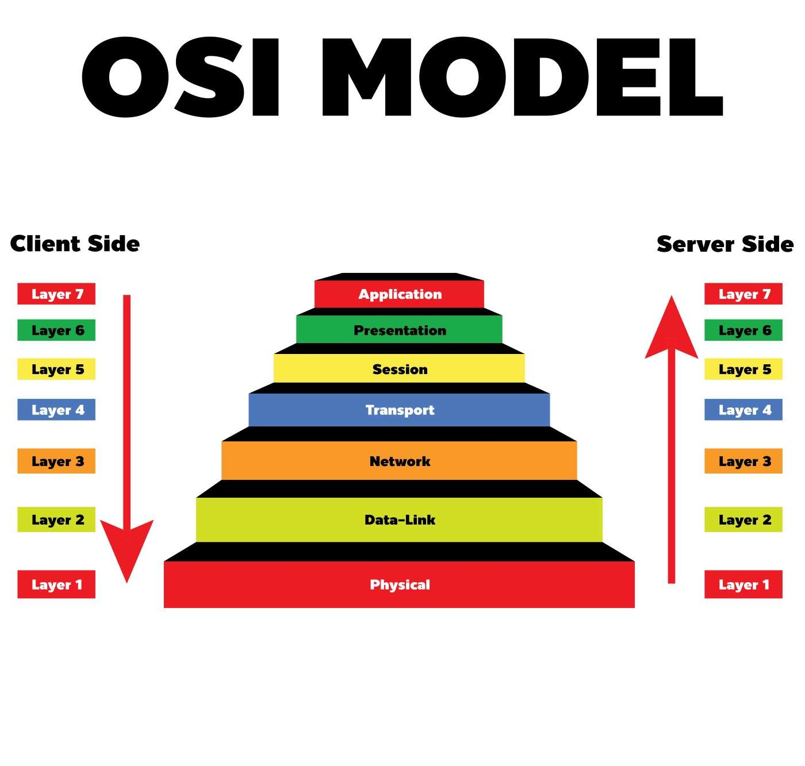
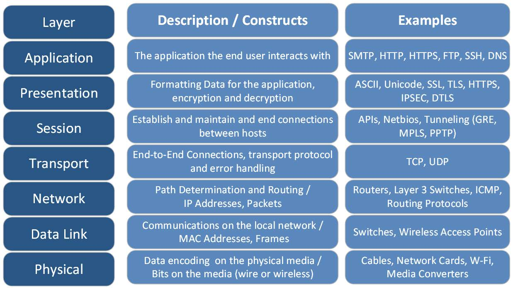

# 1. Model OSI.

Mô hình OSI (Open Systems Interconnection) là mô hình tham chiếu kết nối các hệ thống mở, là tập hợp các đặc điểm kỹ thuật mô tả kiến trúc mạng dành cho việc kết nối các thiết bị không cùng chủng loại. Được tạo nên bởi nguyên lý phân tầng; mỗi tầng giải quyết một phần hẹp của tiến trình truyền thông. Mô hình này có nhiệm vụ thiết lập kết nối truyền thông và thiết kế giao thức mạng giữa các máy tính.

Mô hình OSI được chia thành 7 tầng, mỗi tầng bao gồm những hoạt động, thiết
bị và giao thức mạng khác nhau:

Vai trò của từng tầng được biểu diễn như hình dưới đây:

#### 7 Tầng ứng dụng (Application Layer)

Tầng này nằm ở trên cùng, gần với người dùng nhất; đồng thời cũng là tầng duy nhất giao tiếp trực tiếp với tiến trình ứng dụng và thực hành các dịch vụ thông thường của tiến trình đó. Thông qua chương trình ứng dụng, Application layer cung cấp phương tiện cho người dùng truy nhập các thông tin và dữ liệu trên mạng.

Một số giao thức có trong tầng ứng dụng: Telnet, POP, FTP; HTTP, SMTP, X.400 Mail remote…

VD: SMTP, HTTP, HTTPS, FTP, SSH, DNS.

#### 6 Tầng trình diễn (Presentation Layer)

Tầng trình diễn nằm ngay dưới tầng ứng dụng, hoạt động như tầng dữ liệu trên mạng nhằm cung cấp một giao diện tiêu chuẩn cho tầng ứng dụng. Tầng này có nhiệm vụ phiên dịch, nén, giải nén, giải mã, mã hóa, dữ liệu sang dạng MIME. Cụ thể:

- Phiên dịch dữ liệu theo cú pháp để ứng dụng có thể hiểu
- Mã hóa dữ liệu rồi mới gửi đi và giải mã dữ liệu nhận được
- Nén các dữ liệu trước khi truyền xuống tầng phiên bên dưới.

VD: ASCII, Unicode, SSL, TLS, HTTPS,...

#### 5 Tầng phiên (Session Layer)

Tầng phiên thực hiện các nhiệm vụ:

- Cung cấp các nhu cầu dịch vụ cho tầng trình diễn.
- Cung cấp dịch vụ đánh dấu điểm hoàn thành (checkpointing).
- Hỗ trợ hoạt động đơn công (single), bán song công (half-duplex) hoặc song công (duplex).
- Thiết lập, quản lý và kết thúc các kết nối giữa trình ứng dụng địa phương và trình ứng dụng ở xa.
- Có trách nhiệm “ngắt mạch nhẹ nhàng” (graceful close) các phiên giao dịch, đồng thời kiểm tra và phục hồi phiên.
- Chịu trách nhiệm đóng và mở luồng giao tiếp giữa hai, kiểm soát các (phiên) hội thoại giữa các máy tính, đảm bảo các phiên mở đủ lâu để dữ liệu đủ thời gian gửi đi và đóng đủ nhanh để tiết kiệm tối đa tài nguyên.

VD: APIs,Netbios, Tunneling (GRE,MPLS,PPTP)

#### 4 Tầng vận chuyển (Transport Layer)

Tầng này đảm bảo truyền tải dữ liệu giữa các quá trình. Dữ liệu gởi đi được
đảm bảo không có lỗi, theo đúng trình tự, không bị mất, trùng lặp. Tầng vận chuyển nằm ngay dưới và đáp ứng các nhu cầu của tầng phiên. Tầng này thực hiện các nhiệm vụ sau:

- Chịu trách nhiệm thiết lập kết nối giữa hai máy tính
- Có thể theo dõi và truyền lại các gói tin bị thất bại
- Nhận dữ liệu từ tầng phiên rồi gửi xuống tầng dưới sau khi đã xử lý; đồng thời nhận dữ liệu từ tầng dưới, sau khi xử lý sẽ chuyển lên tầng phiên.
- Chịu trách nhiệm kiểm soát và sửa lỗi (error recovery), điều khiển lưu lượng dữ liệu, đảm bảo dữ liệu được chuyển đi một cách trọn vẹn, chính xác, không gây quá tải cho bên nhận.

Linux hỗ trợ các giao thức TCP và UDP ở tầng này. Mỗi giao thức này có vai trò khác nhau trong việc đảm bảo dữ liệu được giao đến đích một cách đúng đắn.

VD: TCP,UDP

#### 3 Tầng mạng (Network Layer)

Đây là tầng thứ 3 trong mô mô hình 7 tầng của OSI. Tầng này thực hiện các nhiệm vụ sau:

- Đáp ứng các yêu cầu của tầng giao vận, đồng thời cũng đưa ra yêu cầu đối với tầng liên kết dữ liệu bên dưới.
- Đánh địa chỉ cho các gói tin, dịch các địa chỉ logic và tên sang địa chỉ vật lý.
- Cung cấp các thuật toán dò đường cho router, từ đó xác định đường truyền vật lý tốt nhất cho dữ liệu
- Giúp truyền dữ liệu giữa các máy tính nếu ở hai mạng khác nhau.

Tại tầng này, Linux hoạt động thông qua IP Stack, một phần của hạt nhân Linux. IP Stack chịu trách nhiệm định tuyến và chuyển tiếp các gói tin IP. Các thông tin như địa chỉ IP đích, địa chỉ IP nguồn và dữ liệu được gói vào một gói tin IP để gửi. IP Stack cũng xử lý các gói tin IP đến từ tầng liên kết dữ liệu.

VD: Routers, layer 3 switches, ICMP, routing protocol,...

#### 2 Tầng liên kết dữ liệu (Data Link Layer)

Tầng này là nơi các thiết bị chuyển mạch (switches) và các cầu nối (bridge) hoạt động. Về cơ bản, nó giống với tầng mạng, đóng vai trò như sau:

- Gửi thông tin từ nơi này đến một số nơi khác
- Hỗ trợ dữ liệu có thể được truyền đi giữa các thiết bị trong cùng một mạng
- Phát hiện và có thể sửa chữa các lỗi trong tầng vật lý (nếu có).

Trên Linux, tầng này được thực hiện thông qua các trình điều khiển phần cứng mạng. Trình điều khiển mạng sẽ nhận dữ liệu từ tầng mạng (Network Layer), gói dữ liệu thành một frame (khung dữ liệu), sau đó gửi frame qua tầng vật lý. Khi nhận dữ liệu từ tầng vật lý, trình điều khiển mạng sẽ giải mã frame, lấy dữ liệu và chuyển lên tầng mạng. Trình điều khiển mạng cũng đảm nhiệm việc kiểm tra và xử lý lỗi.

VD: Switches, wireless access points,...

#### 1 Tầng vật lý (Physical Layer)

Tầng vật lý hay còn gọi là tầng vật thể hoặc tầng thiết bị. Đây là tầng đầu tiên trong mô hình OSI 7 tầng. Tầng này có trách nhiệm:

- Ứng đối với các đòi hỏi về dịch vụ từ tầng liên kết dữ liệu.
- Thiết lập hoặc ngắt mạch kết nối điện (electrical connection) với một phương tiện truyền thông (transmission medium).
- Tham gia vào quy trình mà ở đó các dữ liệu được chia sẻ hiệu quả giữa nhiều người dùng với nhiệm vụ điều khiển lưu lượng, giải quyết tranh chấp tài nguyên (contention)…
- Điều chế tín hiệu (modulation), hoặc biến đổi giữa biểu diễn dữ liệu kỹ thuật số (digital data) của các máy tính và các tín hiệu tương đương được truyền qua kênh truyền thông (communication channel).
- Tầng vật lý bao gồm các thiết bị phần cứng thực hiện chức năng truyền tải dữ liệu, như: Router (bộ định tuyến), cáp, chân cắm pin, các hiệu điện thế… Ở tầng này gói tin được truyền tải dưới dạng bit 0 và 1.

Tại tầng này, Linux chủ yếu tương tác thông qua trình điều khiển phần cứng (hardware drivers). Các trình điều khiển này là những phần mềm mà nói chuyện trực tiếp với phần cứng mạng như card mạng. Trình điều khiển phần cứng đảm nhận việc chuyển dữ liệu tới và đi từ các thiết bị phần cứng. Linux không kiểm soát trực tiếp tại tầng này, nhưng nó cung cấp môi trường cho các trình điều khiển phần cứng hoạt động.

VD: Cable, Network cards, wifi, media converters...

> Trong bài này ta tập trung và 4 layer đầu: Physical Layer, Data Link Layer, Network Layer, Transport Layer.

# 2. Layer 1 (Physical layer)

Tầng vật lý, còn được biết đến như tầng dưới cùng của mô hình OSI, xử lý truyền thông trực tiếp giữa các thiết bị phần cứng. Nó bao gồm các yếu tố như điện áp, tốc độ dữ liệu vật lý, tối đa chiều dài cáp, và đầu cắm (connectors).

## 2.1. Các thành phần chính

Tầng vật lý xử lý các khía cạnh vật lý của việc truyền thông dữ liệu giữa các thiết bị. Các khía cạnh này có thể bao gồm:

- Đặc điểm vật lý của thiết bị: Điều này liên quan đến cấu trúc vật lý và hoạt động của các thiết bị mạng, bao gồm các cáp, kết nối và cắm.
- Đặc điểm của tín hiệu: Điều này liên quan đến việc xác định cách dữ liệu được mã hóa thành tín hiệu điện, quang học hoặc vô tuyến để truyền qua mạng.
- Topologies: Tầng vật lý cũng định rõ các topology (cấu trúc) mạng phổ biến, như bus, ring, star, mesh, và tree.
- Network Adapters: Tầng vật lý quy định chức năng của các bộ điều hợp mạng (hoặc card mạng) để truyền và nhận dữ liệu.
Standards: Các chuẩn như Ethernet và Wi-Fi được xác định ở tầng vật lý.

## 2.2. Trách nhiệm của người lập trình

Khi làm việc tại tầng vật lý, lập trình viên nhúng Linux có một số trách nhiệm cụ thể như sau:

1. Hiểu rõ về phần cứng: Lập trình viên cần hiểu rõ về phần cứng mà họ đang làm việc. Điều này có nghĩa là hiểu rõ các thông số kỹ thuật của phần cứng, các yêu cầu về điện áp và tín hiệu, và cách các thiết bị giao tiếp với nhau.

1. Xây dựng và tùy chỉnh trình điều khiển thiết bị: Lập trình viên cần phải xây dựng và tùy chỉnh trình điều khiển thiết bị để cho phép hệ điều hành tương tác với phần cứng. Trình điều khiển thiết bị này sẽ là một module kernel được viết bằng ngôn ngữ lập trình C.

1. Kiểm thử và gỡ lỗi trình điều khiển thiết bị: Lập trình viên sẽ cần phải kiểm tra trình điều khiển thiết bị của mình để đảm bảo rằng nó hoạt động đúng. Điều này có thể bao gồm việc kiểm tra việc truyền và nhận dữ liệu, đảm bảo rằng tất cả các yêu cầu điện và tín hiệu đều được tuân thủ, và gỡ lỗi bất kỳ sự cố nào có thể phát sinh.

1. Tối ưu hóa hiệu suất: Lập trình viên cũng có trách nhiệm tối ưu hóa hiệu suất của trình điều khiển thiết bị. Điều này có thể bao gồm việc tối ưu hóa việc truyền và nhận dữ liệu, giảm thiểu độ trễ, và đảm bảo rằng trình điều khiển thiết bị không gây ra tải quá mức cho hệ thống.

1. Cập nhật và duy trì trình điều khiển thiết bị: Trình điều khiển thiết bị cần được cập nhật và bảo dưỡng định kỳ. Lập trình viên cần đảm bảo rằng trình điều khiển thiết bị luôn tương thích với các phiên bản mới của hệ điều hành và không gây ra các vấn đề với hệ thống.

Như vậy, trách nhiệm của lập trình viên khi làm việc ở tầng vật lý rất đa dạng, từ hiểu rõ phần cứng đến viết và duy trì trình điều khiển thiết bị.

## 2.3. Ví dụ

