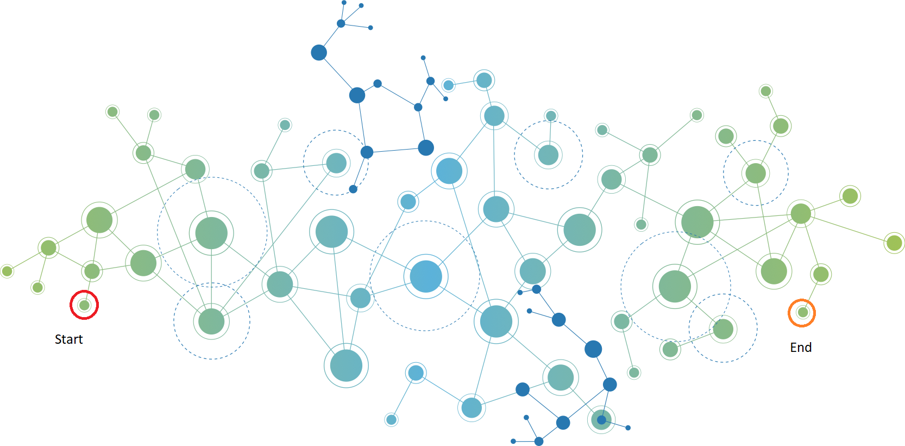

# 1. Model OSI.

Mô hình OSI (Open Systems Interconnection) là mô hình tham chiếu kết nối các hệ thống mở, là tập hợp các đặc điểm kỹ thuật mô tả kiến trúc mạng dành cho việc kết nối các thiết bị không cùng chủng loại. Được tạo nên bởi nguyên lý phân tầng; mỗi tầng giải quyết một phần hẹp của tiến trình truyền thông. Mô hình này có nhiệm vụ thiết lập kết nối truyền thông và thiết kế giao thức mạng giữa các máy tính.

Mô hình OSI được chia thành 7 tầng, mỗi tầng bao gồm những hoạt động, thiết
bị và giao thức mạng khác nhau:


Vai trò của từng tầng được biểu diễn như hình dưới đây:


#### 7 Tầng ứng dụng (Application Layer)

Tầng này nằm ở trên cùng, gần với người dùng nhất; đồng thời cũng là tầng duy nhất giao tiếp trực tiếp với tiến trình ứng dụng và thực hành các dịch vụ thông thường của tiến trình đó. Thông qua chương trình ứng dụng, Application layer cung cấp phương tiện cho người dùng truy nhập các thông tin và dữ liệu trên mạng.

Một số giao thức có trong tầng ứng dụng: Telnet, POP, FTP; HTTP, SMTP, X.400 Mail remote…

VD: SMTP, HTTP, HTTPS, FTP, SSH, DNS.

#### 6 Tầng trình diễn (Presentation Layer)

Tầng trình diễn nằm ngay dưới tầng ứng dụng, hoạt động như tầng dữ liệu trên mạng nhằm cung cấp một giao diện tiêu chuẩn cho tầng ứng dụng. Tầng này có nhiệm vụ phiên dịch, nén, giải nén, giải mã, mã hóa, dữ liệu sang dạng MIME. Cụ thể:

- Phiên dịch dữ liệu theo cú pháp để ứng dụng có thể hiểu
- Mã hóa dữ liệu rồi mới gửi đi và giải mã dữ liệu nhận được
- Nén các dữ liệu trước khi truyền xuống tầng phiên bên dưới.

VD: ASCII, Unicode, SSL, TLS, HTTPS,...

#### 5 Tầng phiên (Session Layer)

Tầng phiên thực hiện các nhiệm vụ:

- Cung cấp các nhu cầu dịch vụ cho tầng trình diễn: Lớp phiên cung cấp dịch vụ để tầng trình diễn (tầng thứ 6 trong mô hình OSI) có thể hoạt động, nghĩa là nó cung cấp giao diện giữa tầng trình diễn và tầng vận chuyển.
- Cung cấp dịch vụ đánh dấu điểm hoàn thành (checkpointing): Lớp phiên cung cấp dịch vụ đánh dấu điểm hoàn thành (checkpointing), giúp ngăn chặn việc mất dữ liệu nếu có lỗi xảy ra.
- Hỗ trợ hoạt động đơn công (single), bán song công (half-duplex) hoặc song công (duplex): Lớp phiên kiểm soát cách thức trao đổi dữ liệu giữa các hệ thống, bao gồm việc trao đổi dữ liệu một chiều (đơn công), trao đổi dữ liệu hai chiều nhưng không đồng thời (bán song công) hoặc trao đổi dữ liệu hai chiều đồng thời (song công).
- Thiết lập, quản lý và kết thúc các kết nối giữa trình ứng dụng địa phương và trình ứng dụng ở xa: Lớp phiên làm nhiệm vụ thiết lập, duy trì và ngắt kết các kết nối giữa các ứng dụng.
- Có trách nhiệm “ngắt mạch nhẹ nhàng” (graceful close) các phiên giao dịch, đồng thời kiểm tra và phục hồi phiên:  Lớp phiên đảm bảo rằng các phiên làm việc được kết thúc một cách an toàn và kiểm tra cũng như phục hồi các phiên làm việc nếu cần thiết.
- Chịu trách nhiệm đóng và mở luồng giao tiếp giữa hai, kiểm soát các (phiên) hội thoại giữa các máy tính, đảm bảo các phiên mở đủ lâu để dữ liệu đủ thời gian gửi đi và đóng đủ nhanh để tiết kiệm tối đa tài nguyên.

VD: APIs,Netbios, Tunneling (GRE,MPLS,PPTP)


#### 4 Tầng vận chuyển (Transport Layer)

Tầng này đảm bảo truyền tải dữ liệu giữa các quá trình. Dữ liệu gởi đi được
đảm bảo không có lỗi, theo đúng trình tự, không bị mất, trùng lặp. Tầng vận chuyển nằm ngay dưới và đáp ứng các nhu cầu của tầng phiên. Tầng này thực hiện các nhiệm vụ sau:

- Chịu trách nhiệm thiết lập kết nối giữa hai máy tính
- Có thể theo dõi và truyền lại các gói tin bị thất bại
- Nhận dữ liệu từ tầng phiên rồi gửi xuống tầng dưới sau khi đã xử lý; đồng thời nhận dữ liệu từ tầng dưới, sau khi xử lý sẽ chuyển lên tầng phiên.
- Chịu trách nhiệm kiểm soát và sửa lỗi (error recovery), điều khiển lưu lượng dữ liệu, đảm bảo dữ liệu được chuyển đi một cách trọn vẹn, chính xác, không gây quá tải cho bên nhận.

Linux hỗ trợ các giao thức TCP và UDP ở tầng này. Mỗi giao thức này có vai trò khác nhau trong việc đảm bảo dữ liệu được giao đến đích một cách đúng đắn.

VD: TCP,UDP

#### 3 Tầng mạng (Network Layer)

Đây là tầng thứ 3 trong mô mô hình 7 tầng của OSI. Tầng này thực hiện các nhiệm vụ sau:

- Đáp ứng các yêu cầu của tầng giao vận, đồng thời cũng đưa ra yêu cầu đối với tầng liên kết dữ liệu bên dưới.
- Đánh địa chỉ cho các gói tin, dịch các địa chỉ logic và tên sang địa chỉ vật lý.
- Cung cấp các thuật toán dò đường cho router, từ đó xác định đường truyền vật lý tốt nhất cho dữ liệu
- Giúp truyền dữ liệu giữa các máy tính nếu ở hai mạng khác nhau.

Tại tầng này, Linux hoạt động thông qua IP Stack, một phần của hạt nhân Linux. IP Stack chịu trách nhiệm định tuyến và chuyển tiếp các gói tin IP. Các thông tin như địa chỉ IP đích, địa chỉ IP nguồn và dữ liệu được gói vào một gói tin IP để gửi. IP Stack cũng xử lý các gói tin IP đến từ tầng liên kết dữ liệu.

VD: Routers, layer 3 switches, ICMP, routing protocol,...

#### 2 Tầng liên kết dữ liệu (Data Link Layer)

Tầng này là nơi các thiết bị chuyển mạch (switches) và các cầu nối (bridge) hoạt động. Về cơ bản, nó giống với tầng mạng, đóng vai trò như sau:

- Gửi thông tin từ nơi này đến một số nơi khác
- Hỗ trợ dữ liệu có thể được truyền đi giữa các thiết bị trong cùng một mạng
- Phát hiện và có thể sửa chữa các lỗi trong tầng vật lý (nếu có).

Trên Linux, tầng này được thực hiện thông qua các trình điều khiển phần cứng mạng. Trình điều khiển mạng sẽ nhận dữ liệu từ tầng mạng (Network Layer), gói dữ liệu thành một frame (khung dữ liệu), sau đó gửi frame qua tầng vật lý. Khi nhận dữ liệu từ tầng vật lý, trình điều khiển mạng sẽ giải mã frame, lấy dữ liệu và chuyển lên tầng mạng. Trình điều khiển mạng cũng đảm nhiệm việc kiểm tra và xử lý lỗi.

VD: Switches, wireless access points,...

#### 1 Tầng vật lý (Physical Layer)

Tầng vật lý hay còn gọi là tầng vật thể hoặc tầng thiết bị. Đây là tầng đầu tiên trong mô hình OSI 7 tầng. Tầng này có trách nhiệm:

- Ứng đối với các đòi hỏi về dịch vụ từ tầng liên kết dữ liệu.
- Thiết lập hoặc ngắt mạch kết nối điện (electrical connection) với một phương tiện truyền thông (transmission medium).
- Tham gia vào quy trình mà ở đó các dữ liệu được chia sẻ hiệu quả giữa nhiều người dùng với nhiệm vụ điều khiển lưu lượng, giải quyết tranh chấp tài nguyên (contention)…
- Điều chế tín hiệu (modulation), hoặc biến đổi giữa biểu diễn dữ liệu kỹ thuật số (digital data) của các máy tính và các tín hiệu tương đương được truyền qua kênh truyền thông (communication channel).
- Tầng vật lý bao gồm các thiết bị phần cứng thực hiện chức năng truyền tải dữ liệu, như: Router (bộ định tuyến), cáp, chân cắm pin, các hiệu điện thế… Ở tầng này gói tin được truyền tải dưới dạng bit 0 và 1.

Tại tầng này, Linux chủ yếu tương tác thông qua trình điều khiển phần cứng (hardware drivers). Các trình điều khiển này là những phần mềm mà nói chuyện trực tiếp với phần cứng mạng như card mạng. Trình điều khiển phần cứng đảm nhận việc chuyển dữ liệu tới và đi từ các thiết bị phần cứng. Linux không kiểm soát trực tiếp tại tầng này, nhưng nó cung cấp môi trường cho các trình điều khiển phần cứng hoạt động.

VD: Cable, Network cards, wifi, media converters...

> Tóm lại:
>- Lớp ứng dụng (Application Layer): Lớp này giống như giao diện người dùng trên một ứng dụng. Đây là lớp mà người dùng tương tác với các ứng dụng và dịch vụ mạng.
>- Lớp trình diễn (Presentation Layer): Lớp này như một thông dịch viên. Nó chuyển đổi dữ liệu từ định dạng mà ứng dụng có thể hiểu sang định dạng mà mạng có thể chuyển và ngược lại
>- Lớp phiên (Session Layer): Lớp này tương tự như việc kiểm tra ID khi bạn đi vào một sự kiện. Nó quản lý việc thiết lập và ngắt kết nối giữa hai hệ thống đang trao đổi thông tin.
>- Lớp vận chuyển (Transport Layer): Lớp này giống như những người giao hàng. Nó chịu trách nhiệm vận chuyển dữ liệu từ nguồn đến đích một cách an toàn. Nó chia dữ liệu thành các phần nhỏ (gói) và sau đó tập hợp lại ở đích.
>- Lớp mạng (Network Layer): Lớp này tương tự như bản đồ trên con đường. Nó xác định địa chỉ IP và quyết định đường đi tốt nhất để truyền dữ liệu từ điểm này đến điểm khác.
>- Lớp liên kết dữ liệu (Data Link Layer): Nó tương tự như một giao điểm trên con đường. Nhiệm vụ của nó là kiểm soát việc chuyển dữ liệu an toàn giữa hai điểm trên cùng một mạng. Nó có thể kiểm tra lỗi và thực hiện việc điều chỉnh nếu cần.
>- Lớp vật lý (Physical Layer): Lớp này tương tự như các dây cáp và phần cứng khác dùng để truyền tải dữ liệu. Đại diện hình dạng là một con đường, nơi mà dữ liệu (như những chiếc xe) được truyền đi.

VD: Hãy tưởng tượng chúng ta đang gửi một lô hàng từ điểm A đến điểm B để minh họa ví dụ này:



- Lớp Ứng Dụng (Application Layer): Đây là khâu đặt hàng, nơi bạn tạo ra một yêu cầu gửi hàng. Bạn chọn mặt hàng cần gửi và thông báo cho công ty vận chuyển.

- Lớp Trình Diễn (Presentation Layer): Đây là khâu chuẩn bị hàng hóa. Mặt hàng được đóng gói theo cách thích hợp để đảm bảo an toàn trong quá trình vận chuyển.

- Lớp Phiên (Session Layer): Đây là khâu làm hợp đồng với công ty vận chuyển. Các chi tiết về việc gửi hàng được thỏa thuận, bao gồm việc thiết lập và ngắt kết nối với dịch vụ vận chuyển.

- Lớp Vận Chuyển (Transport Layer): Đây là khâu phân chia lô hàng. Nếu lô hàng quá lớn, nó sẽ được chia thành các phần nhỏ để dễ dàng vận chuyển. Mỗi phần nhỏ sau đó được đánh dấu để có thể tập hợp lại đúng thứ tự ở điểm đích.

- Lớp Mạng (Network Layer): Đây là khâu xác định lộ trình. Công ty vận chuyển sẽ xác định đường đi tốt nhất để đưa hàng đến điểm đích dựa trên địa chỉ IP (trong trường hợp này, là địa chỉ giao hàng). Như trên hình tại điểm bắt đầu (start) công ty vận chuyển sẽ phải xác định con đường để vận chuyển hàng đến điểm đích (end), các gói hàng có thể vận chuyển bằng nhiều con đường khác nhau sau đó tập hợp lại tại điểm đích.

- Lớp Liên Kết Dữ liệu (Data Link Layer): Đây là khâu chuyển giao hàng hóa. Khi hàng hóa đến một giao điểm nào đó trên mạng, lớp này kiểm soát việc chuyển hàng hóa từ điểm này sang điểm khác trên cùng mạng. Bạn có thể hình dung các giao điểm là trung tâm trung chuyển hàng hoá.

- Lớp Vật Lý (Physical Layer): Đây là khâu vận chuyển thực tế. Lô hàng được đặt trên xe tải, tàu hoặc máy bay và được vận chuyển qua các con đường, đường sắt hoặc không gian để đến nơi đích. Đây chính là phần cứng - cáp quang, dây đồng, v.v. - mà dữ liệu di chuyển trên đó.


Trong bài này ta tập trung và 4 layer đầu: Physical Layer, Data Link Layer, Network Layer, Transport Layer.

# 2. Layer 7 (Application Layer)

Tầng ứng dụng, hay tầng thứ bảy trong mô hình OSI, là tầng cao nhất, trực tiếp giao tiếp với người dùng cuối. Tầng này cung cấp giao diện để người dùng tương tác với ứng dụng thông qua các giao thức mạng.

## 2.1 Mô tả chung

Tầng ứng dụng không thực sự phải là một ứng dụng mà người dùng tương tác trực tiếp. Thay vào đó, nó cung cấp các dịch vụ mà các ứng dụng cần để thực hiện các hoạt động mạng, như gửi email, truy cập trang web, hay chia sẻ file.

Các giao thức thông dụng ở tầng này bao gồm HTTP (Hypertext Transfer Protocol) cho web browsing, SMTP (Simple Mail Transfer Protocol) cho email, FTP (File Transfer Protocol) cho file transfer, và DNS (Domain Name System) cho dịch vụ tên miền.

## 2.2 Nhiệm vụ của lập trình viên

Lập trình viên khi làm việc với tầng ứng dụng trong mô hình OSI cần nắm vững những giao thức được sử dụng ở tầng này. Họ cần hiểu rõ cách mà các giao thức này hoạt động và cách ứng dụng của họ tương tác với chúng.

Ví dụ, nếu một lập trình viên đang phát triển một ứng dụng web, họ cần biết cách sử dụng HTTP để gửi và nhận thông tin qua mạng. Nếu họ đang viết một ứng dụng email, họ cần hiểu cách SMTP hoạt động.

Lập trình viên cũng cần hiểu rõ cách các ứng dụng của họ tương tác với tầng dưới, tầng vận chuyển (Transport Layer). Điều này đòi hỏi hiểu biết về các giao thức như TCP và UDP, cũng như cách họ được sử dụng để chuyển giao dữ liệu giữa máy tính.

## 2.3 Ví dụ


# 3. Layer 6 (Session Layer)

## 3.1 Mô tả chung

Tầng Phiên trong mô hình OSI đóng vai trò như một "phiên dịch viên" giữa tầng ứng dụng (Layer 7) và tầng vận chuyển (Layer 5). Nó đảm bảo rằng dữ liệu được truyền qua mạng có thể được hiểu và xử lý bởi các hệ thống nhận.

## 3.2 Các Chức năng Chính

### 3.2.1 Dịch

Tầng này chuyển đổi dữ liệu giữa các định dạng mà tầng ứng dụng và tầng vận chuyển có thể hiểu được. Điều này bao gồm việc chuyển đổi giữa các định dạng dữ liệu chuẩn, như ASCII, EBCDIC, hoặc biểu diễn số.

### 3.2.2 Mã hóa
Tầng Phiên có thể mã hóa dữ liệu để bảo mật thông tin. Các thuật toán mã hóa, như SSL/TLS, có thể được áp dụng tại tầng này để đảm bảo rằng dữ liệu được truyền một cách an toàn trên mạng.

### 3.2.3 Nén
Tầng này cũng cung cấp khả năng nén dữ liệu, giúp tối ưu hóa băng thông và thời gian truyền.

## 3.3 Ví dụ

Trong Linux, nhiều ứng dụng và dịch vụ sử dụng các giao thức tại tầng Phiên (Presentation Layer). Một ví dụ điển hình là việc sử dụng SSL/TLS trong các giao thức mạng như HTTPS.

```
#include <stdio.h>
#include <curl/curl.h>

int my_debug_callback(CURL *handle, curl_infotype type, char *data, size_t size, void *userptr)
{
    if (type == CURLINFO_TEXT || type == CURLINFO_SSL_DATA_IN || type == CURLINFO_SSL_DATA_OUT)
    {
        fprintf(stderr, "%s", data);
    }
    return 0;
}

int main(void)
{
    CURL *curl;
    CURLcode res;

    curl_global_init(CURL_GLOBAL_DEFAULT);

    curl = curl_easy_init();
    if (curl)
    {
        curl_easy_setopt(curl, CURLOPT_URL, "https://example.com");
        curl_easy_setopt(curl, CURLOPT_DEBUGFUNCTION, my_debug_callback);
        curl_easy_setopt(curl, CURLOPT_VERBOSE, 1L);

        res = curl_easy_perform(curl);

        if (res != CURLE_OK)
            fprintf(stderr, "curl_easy_perform() failed: %s\n",
                    curl_easy_strerror(res));

        curl_easy_cleanup(curl);
    }

    curl_global_cleanup();

    return 0;
}
```

Trong ví dụ trên, chúng ta đang tạo một yêu cầu HTTPS đến "https://example.com" sử dụng thư viện libcurl. Libcurl sẽ tự động thực hiện việc mã hóa SSL/TLS, tạo một phiên kết nối an toàn giữa client và server.

Phần mã hóa và giải mã SSL/TLS được thực hiện trong hàm curl_easy_perform(), và tất cả các chi tiết về mã hóa được ẩn đi khỏi người lập trình. Libcurl sẽ thực hiện tất cả các bước cần thiết, bao gồm việc trao đổi chứng chỉ, khởi tạo kết nối mã hóa, và mã hóa/ giải mã dữ liệu.

Hàm my_debug_callback() sẽ được gọi với các thông tin khác nhau từ libcurl. Trong hàm callback này, chỉ in ra thông tin nếu nó là loại CURLINFO_TEXT (thông tin chung về quá trình chuyển giao), CURLINFO_SSL_DATA_IN (dữ liệu SSL/TLS đến), hoặc CURLINFO_SSL_DATA_OUT (dữ liệu SSL/TLS đi).

Output:

```
Rebuilt URL to: https://example.com/
  Trying 93.184.216.34...
TCP_NODELAY set
  Trying 2606:2800:220:1:248:1893:25c8:1946...
TCP_NODELAY set
Immediate connect fail for 2606:2800:220:1:248:1893:25c8:1946: Network is unreachable
Connected to example.com (93.184.216.34) port 443 (#0)
found 137 certificates in /etc/ssl/certs/ca-certificates.crt
found 415 certificates in /etc/ssl/certs
ALPN, offering http/1.1
SSL connection using TLS1.2 / ECDHE_RSA_AES_128_GCM_SHA256
         server certificate verification OK
         server certificate status verification SKIPPED
         common name: www.example.org (matched)
         server certificate expiration date OK
         server certificate activation date OK
         certificate public key: RSA
         certificate version: #3
         subject: C=US,ST=California,L=Los Angeles,O=Internet Corporation for Assigned Names and Numbers,CN=www.example.org
         start date: Fri, 13 Jan 2023 00:00:00 GMT
         expire date: Tue, 13 Feb 2024 23:59:59 GMT
         issuer: C=US,O=DigiCert Inc,CN=DigiCert TLS RSA SHA256 2020 CA1
         compression: NULL
ALPN, server accepted to use http/1.1
```

Dòng "SSL connection using TLS1.2 / ECDHE_RSA_AES_128_GCM_SHA256" cho biết một kết nối SSL/TLS đã được thiết lập thành công, và suite mã hóa ECDHE_RSA_AES_128_GCM_SHA256 đã được sử dụng. Điều này bao gồm cả việc mã hóa dữ liệu gửi đi và giải mã dữ liệu nhận về. Tóm lại, đầu ra cho thấy quá trình thiết lập kết nối SSL/TLS, bao gồm cả mã hóa và giải mã, đã thành công.


<!-- -----
# . Layer 1 (Physical layer)

Tầng vật lý, còn được biết đến như tầng dưới cùng của mô hình OSI, xử lý truyền thông trực tiếp giữa các thiết bị phần cứng. Nó bao gồm các yếu tố như điện áp, tốc độ dữ liệu vật lý, tối đa chiều dài cáp, và đầu cắm (connectors).

## 2.1. Các thành phần chính

Tầng vật lý xử lý các khía cạnh vật lý của việc truyền thông dữ liệu giữa các thiết bị. Các khía cạnh này có thể bao gồm:

- Đặc điểm vật lý của thiết bị: Điều này liên quan đến cấu trúc vật lý và hoạt động của các thiết bị mạng, bao gồm các cáp, kết nối và cắm.
- Đặc điểm của tín hiệu: Điều này liên quan đến việc xác định cách dữ liệu được mã hóa thành tín hiệu điện, quang học hoặc vô tuyến để truyền qua mạng.
- Topologies: Tầng vật lý cũng định rõ các topology (cấu trúc) mạng phổ biến, như bus, ring, star, mesh, và tree.
- Network Adapters: Tầng vật lý quy định chức năng của các bộ điều hợp mạng (hoặc card mạng) để truyền và nhận dữ liệu.
Standards: Các chuẩn như Ethernet và Wi-Fi được xác định ở tầng vật lý.

## 2.2. Trách nhiệm của người lập trình

Khi làm việc tại tầng vật lý, lập trình viên nhúng Linux có một số trách nhiệm cụ thể như sau:

1. Hiểu rõ về phần cứng: Lập trình viên cần hiểu rõ về phần cứng mà họ đang làm việc. Điều này có nghĩa là hiểu rõ các thông số kỹ thuật của phần cứng, các yêu cầu về điện áp và tín hiệu, và cách các thiết bị giao tiếp với nhau.

1. Xây dựng và tùy chỉnh trình điều khiển thiết bị: Lập trình viên cần phải xây dựng và tùy chỉnh trình điều khiển thiết bị để cho phép hệ điều hành tương tác với phần cứng. Trình điều khiển thiết bị này sẽ là một module kernel được viết bằng ngôn ngữ lập trình C.

1. Kiểm thử và gỡ lỗi trình điều khiển thiết bị: Lập trình viên sẽ cần phải kiểm tra trình điều khiển thiết bị của mình để đảm bảo rằng nó hoạt động đúng. Điều này có thể bao gồm việc kiểm tra việc truyền và nhận dữ liệu, đảm bảo rằng tất cả các yêu cầu điện và tín hiệu đều được tuân thủ, và gỡ lỗi bất kỳ sự cố nào có thể phát sinh.

1. Tối ưu hóa hiệu suất: Lập trình viên cũng có trách nhiệm tối ưu hóa hiệu suất của trình điều khiển thiết bị. Điều này có thể bao gồm việc tối ưu hóa việc truyền và nhận dữ liệu, giảm thiểu độ trễ, và đảm bảo rằng trình điều khiển thiết bị không gây ra tải quá mức cho hệ thống.

1. Cập nhật và duy trì trình điều khiển thiết bị: Trình điều khiển thiết bị cần được cập nhật và bảo dưỡng định kỳ. Lập trình viên cần đảm bảo rằng trình điều khiển thiết bị luôn tương thích với các phiên bản mới của hệ điều hành và không gây ra các vấn đề với hệ thống.

Như vậy, trách nhiệm của lập trình viên khi làm việc ở tầng vật lý rất đa dạng, từ hiểu rõ phần cứng đến viết và duy trì trình điều khiển thiết bị.

## 2.3. Ví dụ
 -->
